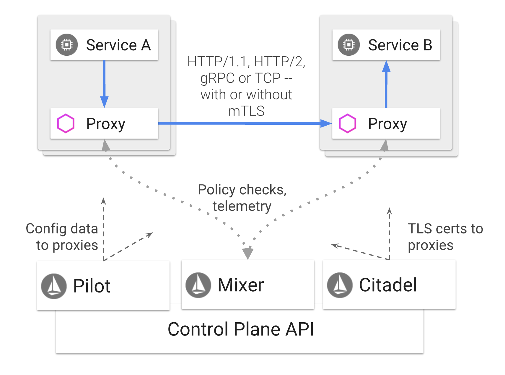
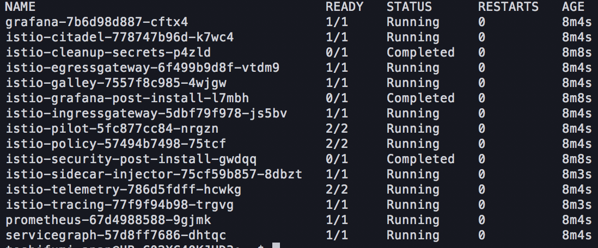

# Istio Components

## Component紹介

Istioは下記のようなアーキテクチャで動きます。

Istioのコンポーネントとして実際に起動しているPodは下記の通りです。

これを実際のPodに置き換えるとこんな感じです。

通信の流れを記載します。

// TODO 通信フローを記載 //

### ingress-gateway

外部からクラスターにアクセスする際のgatewayです。トラフィックをRoutingするための最重要コンポーネントといっていいと思います。ちなみに、実際Podの中ではEnvoyのプロセスが動いています。

### egress-gateway

クラスター内から外部環境へアクセスする際のgatewayです。

### sidecar-injector

Istio-Proxyをサイドカーコンテナとしてinjectするためのコンポーネントです。

### istio-telemetry

Istio関連の統計情報を収集するためのコンポーネントです。

### Pilot

Istio（Envoy）の設定を各sidecarコンテナに反映するためのコンポーネントです。

### citadel

証明書を管理するためのコンポーネントです。

### gallaly

### Plugin

下記のようなプラグインがあります。

- tracing
- grafana
- prometheus
- servicegraph

### Istio-proxy

sidecarコンテナとして、Podの中に起動するコンテナです。

## 参考資料

- https://istio.io/docs/concepts/what-is-istio/
